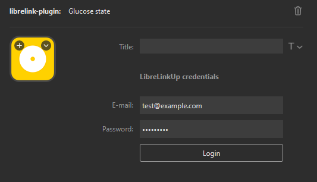

# StreamDeck LibreLink Plugin

**_This is an unofficial, custom plugin._**

## Installation

1. Go to the latest release: https://github.com/Leczok12/streamdeck-librelink-plugin/releases/latest
2. Download the file **com.kamil-leczkowski.librelink-plugin.streamDeckPlugin**
3. After downloading, right-click on the file and select "Open with Stream Deck"

## Appearance

|         |             Low             |            Ok             |             High              |
| :-----: | :-------------------------: | :-----------------------: | :---------------------------: |
| Rising  |   |   |   |
|  Flat   |   |   |   |
| Falling |  |  |  |

|            Login Page             |
| :-------------------------------: |
|  |

## Usage

1. Log in using your LibreLinkUp account credentials.

> **Note**: Occasionally, the server may return a 430 error code. This typically means that too many login requests have been made in a short period of time. If this occurs, please wait approximately 1 minute before attempting to log in again by pressing the button.

## Special Thanks

A big thanks to [DiaKEM](https://github.com/DiaKEM) for their work! I created my custom client based on their project, [libre-link-up-api-client](https://github.com/DiaKEM/libre-link-up-api-client).
